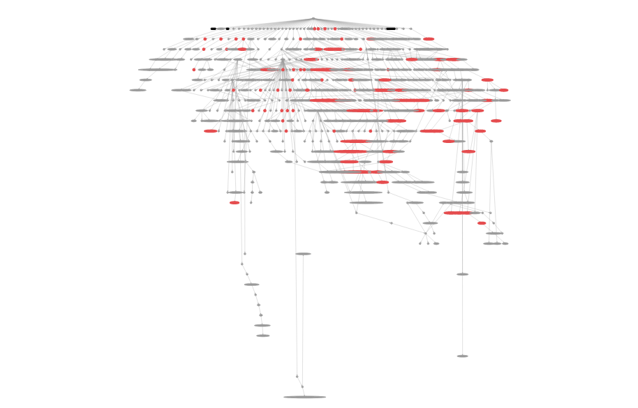
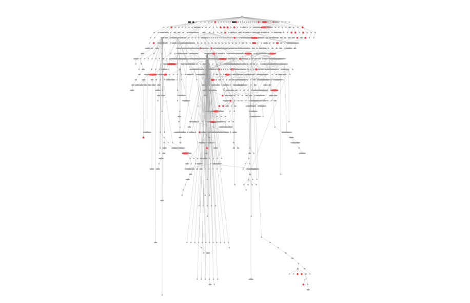

# OneProfile

## 背景

Chrome Dev Tools 自带的 CPU Profile 功能非常好用。用它可以方便的生成 JavaScript 的 `Flame Chart`。


更棒的是你可以把 `Flame Chart` 导出，留着下次或者拷贝到其它机器上查看，特别好奇它是怎么实现的。

但是网上关于它的文件格式以及怎么画图的文档非常稀有，所以我自己摸索了一下它的文件格式,并尝试着用另一种方式展示 CPU Profile 的结果。

## 如何生成 CPU Profile 文件

使用最新版的 Chrome 打开任意一个 [测试网站](http://oneapm.com)，按 F12 打开 `Devtools`， 切换到 `Profiles` 页，点击 `Start` 开始
收集 Profile 信息，在当前页面任意滑动鼠标等待大约5秒后， 点击 `Stop` 停止 Profile。在生成的 CPU Profile 名字上单击右键可以导出 `.cpuprofile` 后缀名的文件。

你可以自己生成一个，也可以直接下载这个用来测试 [sample.cpuprofile](https://raw.githubusercontent.com/wyvernnot/javascript_performance_measurement/gh-pages/cpuprofile_topology/sample.cpuprofile)

## 理解 .cpuprofile 文件格式

用你的编辑器打开 `sample.cpuprofile` ，你会惊奇的发现：

1\. `sample.cpuprofile` 其实就是一个 JSON 格式的文件，有 `head`, `timestamps`, `samples` 等几个重要的属性

2\. `head` 指向一个结点，官方的名字叫`CpuProfileNode`，同时它的 `children` 指向子结点, 因此是一个嵌套结构

3\. `CpuProfileNode` 有很多重要的属性，包括 functionName，lineNumber，columnNumber，hitCount 等

4\. `timestamps` 是一个数组，记录着 Profiling 过程中每个采样点的时间戳

5\. 对应 `timestamps` 下的每个时间点，`samples` 数组相同的位置都会有一个数字，这个数字比较神秘，后面解释

**CpuProfileNode 详解**

```js
{
  "functionName": "lineTo",
  "scriptId": "0",
  "url": "",
  "lineNumber": 0,
  "columnNumber": 0,
  "hitCount": 45,         // 被采样到的次数
  "callUID": 6,           // 函数入口的 UID
  "children": [],
  "positionTicks": [      
    {
      "line": 1,
      "ticks": 45
    }
  ],
  "deoptReason": "",     // 逆优化的原因
  "id": 11
}
```

**samples, timestamps 和 CpuProfileNode 的关系**

如果从 `head` 开始，对 `head` 结点及其 `children` 属性下的结点做一次深度优先的遍历，每个可能路径都会有一个编号。
研究表明这个数字正对应于 `samples` 的值。因此知道了路径编号，便可以知道那些函数处在激活状态。在 `OneProfile` 中用蓝色表示。

## OneProfile 使用说明

**链接地址**

使用 Chrome 打开： [OneProfile](http://wyvernnot.github.io/javascript_performance_measurement/cpuprofile_topology/)

**图例**

`黑色`      系统函数

`暗红色`    存在逆优化的函数，鼠标悬停可见原因

`蓝色`      当前采样点活动的函数

**操作**

`滚轮`       缩放窗口

`prev`      前一个采样点

`next`      后一个采样点

**一些用例**

百度地图：



淘宝首页：

