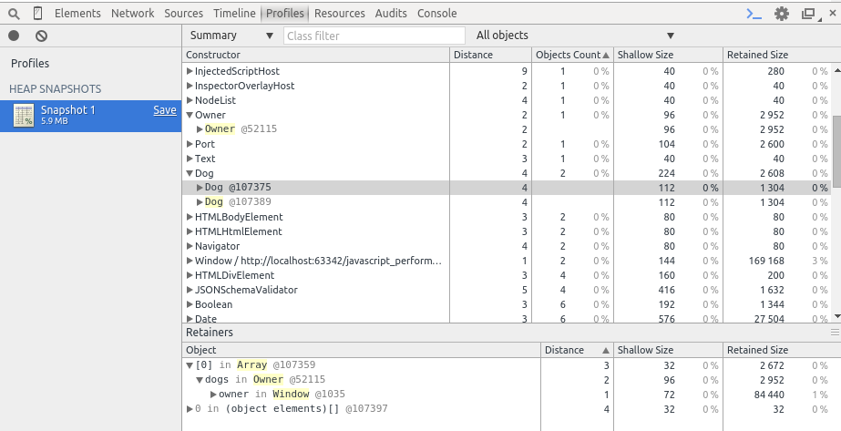
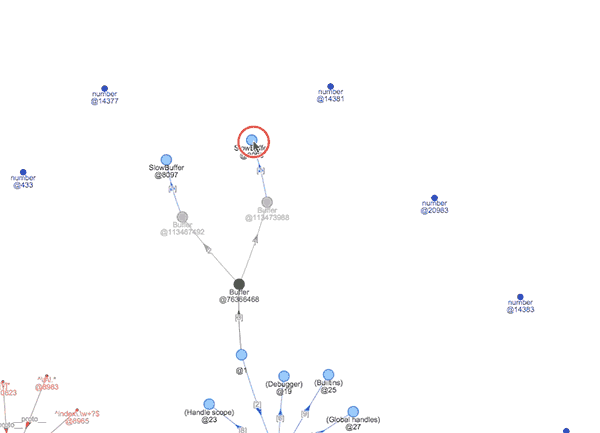
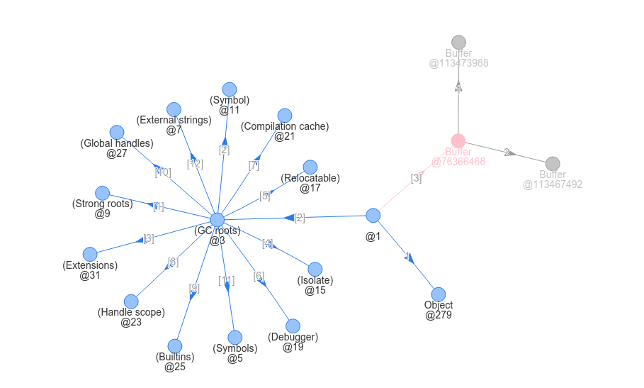
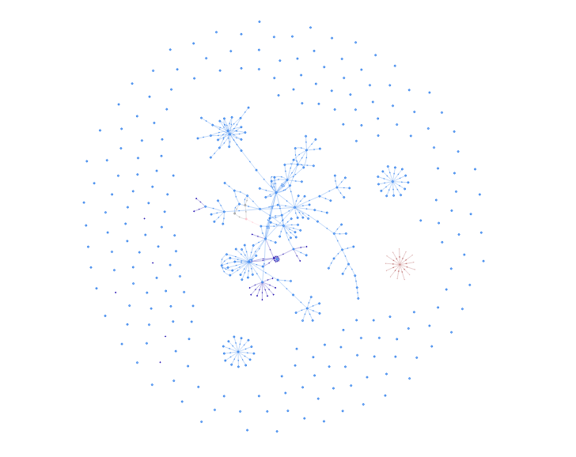
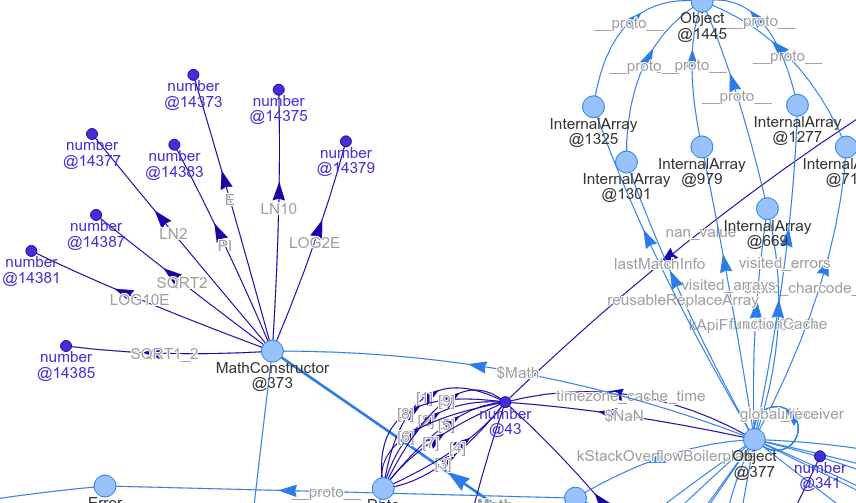
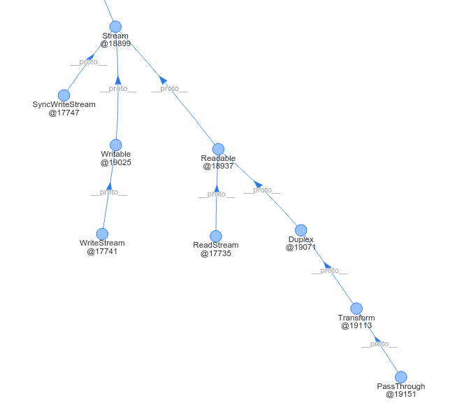

# OneHeap

## 背景

JavaScript 运行过程中的大部分数据都保存在堆 (Heap) 中，所以 JavaScript 性能分析另一个比较重要的方面是内存，也就是堆的分析。

利用 Chrome Dev Tools 可以生成应用程序某个时刻的堆快照 (HeapSnapshot)，它较完整地记录了各种对象和引用的情况，堪称查找内存泄露问题的神器。
和 Profile 结果一样，快照可以被导出成 `.heapsnapshot` 文件。



上周发布了工具 [OneProfile](http://wyvernnot.github.io/javascript_performance_measurement/cpuprofile_topology/) ，
可以用来动态地展示 Profile 的结果，分析各种函数的调用关系。周末我用类似的思路研究了一下 `.heapsnapshot` 文件，做了这个网页小工具，把 Heap Snapshot 
用有向图的方式展现出来。



## OneHeap 名字的由来

> There are only two hard things in Computer Science: cache invalidation and naming things. -- Phil Karlton

目前还没有时间想一个高端、大气、上档次的名字，因为我供职的公司名叫 [OneAPM](http://www.oneapm.com/info/about.html) 
( 省去软广1000字，总之做性能监控很牛)，所以就取名 OneHeap 啦。 它是 [Toolkit](https://github.com/wyvernnot/javascript_performance_measurement/) 里的第二个。

## 如何生成 Heap Snapshot 文件

**浏览器**

使用 Chrome 打开 [测试页面](http://wyvernnot.github.io/javascript_performance_measurement/heap_snapshot/dog.html)
按 F12 打开 `Devtools`，切换到 `Profiles` 页，选择 `Take Heap Snapshot`。稍等片刻，在生成的 `Snapshot` 上点击右键可以导出，文件后缀一般是 `.heapsnapshot`。

**Node.JS**

如果你是 Node.JS 工程师，可以安装 `heapdump` 这个很有名的模块。

[https://github.com/bnoordhuis/node-heapdump](https://github.com/bnoordhuis/node-heapdump)

上面两种方法都可以生成 `.heapsnapshot` 文件，这个是用来测试的 [nodejs.heapsnapshot](http://wyvernnot.github.io/javascript_performance_measurement/heap_snapshot/nodejs.heapsnapshot)

## 理解 .heapsnapshot 文件格式

打开测试用的 `nodejs.heapsnapshot` 文件，这是一个很大的 JSON 对象：

1\. `snapshot` 属性保存了关于快照的一些基本信息，如 uid，快照名，节点个数等

2\. `nodes` 保存了是所有节点的 id，name，大小信息等,对应 v8 源码里的 [`HeapGraphNode`](https://github.com/joyent/node/blob/master/deps/v8/include/v8-profiler.h#L219)

3\. `edges` 属性保存了节点间的映射关系，对应 v8 源码的 [`HeapGraphEdge`](https://github.com/joyent/node/blob/master/deps/v8/include/v8-profiler.h#L183)

4\. `strings` 保存了所有的字符串， `nodes` 和 `edges` 中不会直接存字符串，而是存了字符串在 `strings` 中的索引

堆快照其实是一个有向图的数据结构，但是 `.heapsnapshot` 文件在存储的过程中使用了数组来存储图的结构，这一设计十分巧妙而且减少了所需磁盘空间的大小。

### nodes 属性

nodes 是一个很长一维的数组，但是为了阅读方便，v8 在序列化的时候会自动加上换行。按照 v8 版本的不同，可能是5个一行，也可能是6个一行，如果是 6 个一行，则多出来的一个 `trace_node_id` 属性。

|下标   |属性          |类型            |
|-------|-------------|---------------|
|n      |type         |number         |
|n+1    |name         |string         |
|n+2    |id           |number         |
|n+3    |self_size    |number         |
|n+4    |edge_count   |number         |

其中 type 是一个 0~12 的数字，目前的 Chrome 只有 0~9 这几个属性，它们对应的含义分别是

|编号|属性|说明
|----|----|----
|0|hidden|Hidden node, may be filtered when shown to user.
|1|array|An array of elements.
|2|string|A string.
|3|object|A JS object (except for arrays and strings).
|4|code|Compiled code.
|5|closure|Function closure.
|6|regexp|RegExp.
|7|number|Number stored in the heap.
|8|native|Native object (not from V8 heap).
|9|synthetic|Synthetic object, usualy used for grouping snapshot items together.
|10|concatenated string|Concatenated string. A pair of pointers to strings.
|11|sliced string|Sliced string. A fragment of another string.
|12|symbol|A Symbol (ES6).

### edges 属性

`edges` 也是一个一维数组，长度要比 `nodes` 大好几倍，并且相对于 `nodes` 要复杂一些：

|下标   |属性          |类型
|------|--------------|----------------
|n      |type         |number          
|n+1    |name_or_index|string_or_number
|n+2    |to_node      |node            

其中 type 是一个 0~6 的数字：

|编号|属性|说明|
|----|----|----|
|0|context|A variable from a function context.
|1|element|An element of an array
|2|property|A named object property.
|3|internal|A link that can't be accessed from JS,thus, its name isn't a real property name (e.g. parts of a ConsString).
|4|hidden|A link that is needed for proper sizes calculation, but may be hidden from user.
|5|shortcut|A link that must not be followed during sizes calculation.
|6|weak|A weak reference (ignored by the GC).

**nodes 和 edges 的对应关系**

如果知道某个节点的 id，是没有办法直接从 `edges` 中查出和它相邻的点的，因为 `edges` 并不是一个 `from-to` 的 Hash。想知道从一个节点出发
可到达那些节点，需要遍历一次 `nodes`。

具体做法如下：

1\. 在遍历 `nodes` 前初始化一个变量 `edge_offset`，初始值是0，每遍历一个节点都会改变它的值。

2\. 遍历某个节点 Nx 的过程中：

从 Nx 出发的第一条 Edge

```
edges[ edge_offset ]      是 Edge 的类型
edges[ edge_offset +1 ]   是 Edge 的名称或下标
edges[ edge_offset +2 ]   是 Edge 指向的对象的节点类型在 `nodes` 里的索引
```

从 Nx 出发的第2条 Edge

```
edges[ edge_offset + 3 ]  
     ............         是下一个 Edge 
edges[ edge_offset + 5 ]
```

从 Nx 出发，一共有 `edge_count` 条 Edge 

...

3\. 每遍历完一个节点，就在 `edge_offset` 上加 ` 3 x edge_count `，并回到步骤 2，直到所有节点都遍历完


步骤1到3 用伪代码表示就是：

```
edge_offset=0

// 遍历每一个节点
for(node in nodes){
 
  // edges 下标从 edge_offset 到 edge_offset + 3 x edge_count 都是 node 可以到达的点
  edge_offset+= 3 x node.edge_count
}
```

以上就是 `.heapsnapshot` 的文件格式定义了，基于这些发现，在结合一个前端绘图的库，就可以可视化的展示 Heap Snapshot 了。

## OneHeap 使用说明

**链接地址**

使用 Chrome 打开： [OneHeap](http://wyvernnot.github.io/javascript_performance_measurement/heap_snapshot/)

### 一些有意思的截图

**@1**

Node.JS



*朴灵老师的《深入浅出Node.JS》有对 Buffer 的详细介绍，其中提到 Buffer 是 JavaScript 和 C++ 技术结合的典型代表*

浏览器


*很明显浏览器下多了 Window 和 Document 对象，而 Detached DOM tree 正是前端内存泄露的高发地。*

**Objects**


*最密集的那部分的中心是 Object 构造函数,如果把 Object 和 Array 构造函数隐藏，就变成了下面这样*



**MathConstructor**



左上角是例如 `自然对数E` 这样的常量，[v8源码](https://github.com/joyent/node/blob/master/deps/v8/src/math.js#L380)

**正则表达式**


所有的正则表达式实例的 `__proto__` 都指向 RegExp 构造函数，同时 RegExp 的 `__proto__` 又指向 Object

**Stream**



在 Node.JS 中和 Stream 相关的几个类的设计和 `Java` 类似，都使用到装饰器的设计模式，层层嵌套, 例如 [v8源码](https://github.com/joyent/node/blob/master/lib/_stream_writable.js#L159)

### 参考资料

[Heap Profiling](https://developers.google.com/chrome-developer-tools/docs/heap-profiling)

[了解 JavaScript 应用程序中的内存泄漏](http://www.ibm.com/developerworks/cn/web/wa-jsmemory/)
