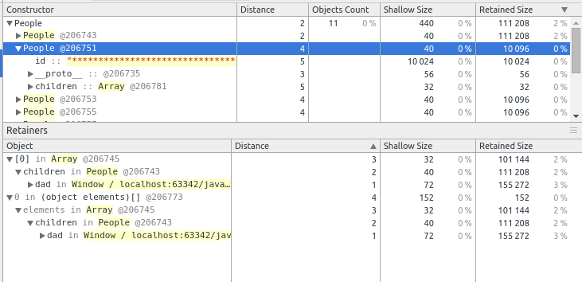

# snapshot 数据结构解读



## Using Heapdump

[https://github.com/bnoordhuis/node-heapdump](https://github.com/bnoordhuis/node-heapdump)

## Using Chrome Dev Tools

运行代码 `index.html`，创建 Snapshot。

随便找一个数字例如 `206751`，在 `nodes.json` 中查找 `206751` ，定位到这行

nodes.json#L3630

```
,3,1726,206751,40,4,0
```

每一列的含义可在 sample.heapsnapshot.json#L4 中找到

```
  "node_fields": [
    "type",
    "name",
    "id",
    "self_size",
    "edge_count",
    "trace_node_id"
  ],
```

type 是一个数字，对应类型存在这个对象里

```
  "node_types": [
    [
      "hidden",
      "array",
      "string",
      "object",
      "code",
      "closure",
      "regexp",
      "number",
      "native",
      "synthetic",
      "concatenated string",
      "sliced string"
    ],
```

关联起来解读：

- 3 type node_types[3]="object" 表示这是一个 object 对象

- 1726 name string[1726]="People" 这个对象的名字是 People

- 206751 id 对象示例的 id

- 40 self_size 对象的 shallow size

- 4 edge_count 

- 0 trace_node_id

string[1726]="People"
@206751 
40 shallow size


```
{ '0': 
   { count: 27627,
     size: 1144320,
     name: 'hidden',
     hsize: '1117.5 k' },
  '1': 
   { count: 8748,
     size: 1972224,
     name: 'array',
     hsize: '1926.0 k' },
  '2': 
   { count: 6107,
     size: 367736,
     name: 'string',
     hsize: '359.1 k' },
  '3': 
   { count: 7178,
     size: 304504,
     name: 'object',
     hsize: '297.4 k' },
  '4': 
   { count: 7024,
     size: 1622640,
     name: 'code',
     hsize: '1584.6 k' },
  '5': 
   { count: 9732,
     size: 700704,
     name: 'closure',
     hsize: '684.3 k' },
  '6': 
   { count: 6,
     size: 384,
     name: 'regexp',
     hsize: '0.4 k' },
  '7': 
   { count: 26,
     size: 416,
     name: 'number',
     hsize: '0.4 k' },
  '8': 
   { count: 16,
     size: 672,
     name: 'native',
     hsize: '0.7 k' },
  '9': 
   { count: 20,
     size: 0,
     name: 'synthetic',
     hsize: '0.0 k' },
  '10': 
   { count: 302,
     size: 12080,
     name: 'concatenated string',
     hsize: '11.8 k' },
  '12': 
   { count: 45,
     size: 1440,
     name: undefined,
     hsize: '1.4 k' } }
```

** 计算结果 实际/DevTools ** 

总计 5984KB / 5984KB
Code 1585KB / 1425KB
Strings 360KB / 303KB
JS Arrays 1926KB / 53KB
